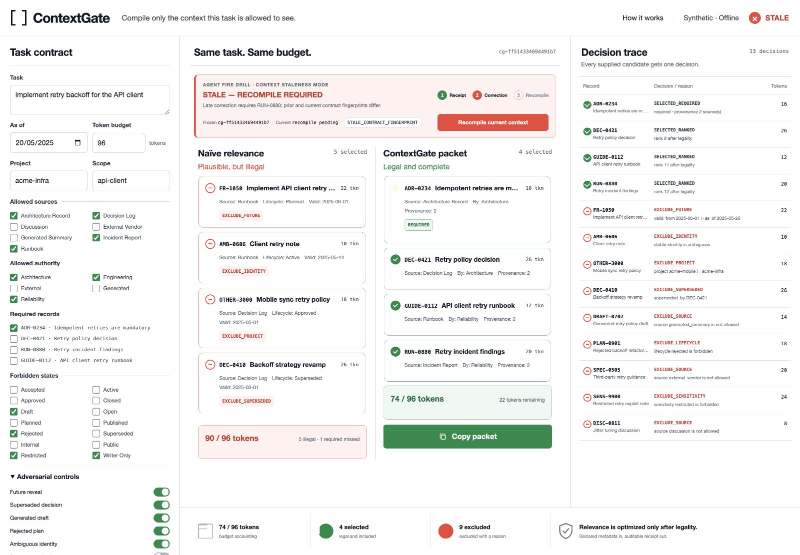

# ContextGate — Deterministic Context Contract Compiler

[](https://github.com/TheDarkniteFalls/sqlite-context-retrieval-example/actions/workflows/checks.yml)

<!-- toolkit-trust-card:start -->
> **Public contract:** Experimental pattern · about 10 min · Python 3 · no model · no network
>
> **Operation:** Read-only check; examples may use temporary files
>
> **A pass establishes:** The synthetic compiler protects required records before ranking, explains every inclusion and exclusion, fails closed on invalid obligations, and rejects stale receipts deterministically.
>
> **It does not establish:** Structured metadata and changes are supplied; the project does not discover runtime changes, authorize actions, verify truth, or prove downstream model safety.
>
> **First check:** `python3 -B contextgate.py check`
<!-- toolkit-trust-card:end -->

> ContextGate compiles the smallest context an AI is allowed to see, proves
> every inclusion and exclusion, and detects when that context must be
> recompiled.

Semantic retrieval can return the most relevant record and still be wrong for
the task. A close match may belong to another project, come from the future,
have been superseded, remain unreviewed, lack provenance, or displace an older
obligation that must not be omitted.

ContextGate is a dependency-free local Context Debugger for that boundary. It
compares a deliberately naïve relevance-only packet with a legality-first
packet under the same task and token budget. Every supplied record receives a
deterministic decision, and an illegal, unsupported, absent, or over-budget
required record stops compilation instead of producing a plausible-looking
partial packet. A deterministic receipt plus contract and packet fingerprints
also makes a declared material change visible after compilation, so an old
packet cannot silently continue.

All fixtures are synthetic. Runtime requires no model, API key, package
install, network access, or external data.



*Agent Fire Drill freezes a valid receipt, then refuses continuation after a
declared late correction until the context is recompiled.*

## Try It in 90 Seconds

Requires Python 3 with SQLite FTS5. From the repository root:

```sh
python3 -B contextgate.py serve --open
```

If the browser does not open automatically, visit
`http://localhost:8765/`. The checked-in retry-policy scenario compiles on
load.

1. Compare **Naïve relevance** with **ContextGate packet**.
2. Find required record `ADR-0234`, which naïve ranking misses.
3. Read the reason code and boundary fact for each of the 13 candidates.
4. In **Agent Fire Drill**, select **Inject late correction** and observe
   `STALE — RECOMPILE REQUIRED`.
5. Select **Recompile current context** and observe a new current receipt with
   `RUN-0880` promoted to required context.
6. Turn on **Remove required provenance**, then select **Compile context**.
7. Observe `REQUIRED_MISSING_PROVENANCE`, a red fail-closed state, and no
   emitted packet.
8. Restore provenance, compile again, and use **Copy packet**.

The default run is deliberately sharp:

| Result | Selected | Tokens | What happened |
| --- | ---: | ---: | --- |
| Naïve relevance | 5 | 90 / 96 | All 5 are illegal; required `ADR-0234` is missed |
| ContextGate | 4 | 74 / 96 | Required obligation protected; 9 candidates excluded with reasons |

Run the entire deterministic check stack with one command:

```sh
python3 -B contextgate.py check
```

See [TESTING.md](TESTING.md) for installation checks, the manual acceptance
route, CLI/API use, and the seven-control matrix.

## The Product Boundary

Retrieval asks which records look similar. ContextGate first compiles a task
contract, then permits ranking only inside the legal candidate set:

```text
structured records + task contract
              |
              v
scope -> identity -> time -> supersession -> source/sensitivity
              -> authority/review -> provenance -> required records
              |
              v
       FTS5 rank legal optionals
              |
              v
       prune optionals to budget
              |
              v
      packet + receipt/fingerprints
              |
              v
declared late change + current contract/records
              |
              v
   continue / recompile_required / block
```

The contract declares:

- task/query and as-of date;
- project and scope;
- allowed source and authority classes;
- required stable record IDs;
- forbidden lifecycle and sensitivity states; and
- token budget.

Required records are resolved before relevance ranking. If a required record
is absent, illegal, unsupported by provenance, or too large for the contract,
ContextGate emits no packet. Optional records are ranked only after legality
checks and pruned last.

## Context Debugger

The responsive interface keeps the complete decision in one view:

- **Contract:** editable task boundaries and seven adversarial controls.
- **Compare:** naïve and legality-first packets under the same budget.
- **Trace:** stable ID, decision/reason code, boundary fact, token contribution,
  and required status for every candidate.
- **Agent Fire Drill:** freeze a receipt, declare one late user correction,
  reject attempted continuation as stale, then recompile to a new receipt.
- **Audit strip:** selected/excluded counts, exact budget accounting, receipt
  ID, and the governing principle.

The checked-in poison controls cover a highly similar future reveal,
superseded decision, generated draft, rejected writer-only plan, ambiguous
identity, missing required provenance, and required record that cannot fit the
budget. Desktop uses a three-rail debugger; smaller screens switch to Contract,
Compare, and Trace tabs.

## CLI and Local API

Compile the default scenario in the terminal:

```sh
python3 -B contextgate.py compile
python3 -B contextgate.py compile --json
```

Exercise the two fail-closed paths directly. Exit code `2` is expected because
no packet is emitted:

```sh
python3 -B contextgate.py compile --remove-required-provenance
python3 -B contextgate.py compile --tight-token-budget
```

The local server exposes:

- `GET /api/health`
- `GET /api/scenario`
- `GET /api/compile`
- `POST /api/compile`
- `POST /api/fire-drill`

`POST /api/compile` input must contain exactly `contract` and `controls`.
Contract, record, and control schemas reject unknown fields. The fire-drill
request contains a supplied prior receipt, declared change, current contract,
and controls. The server reloads the current fixture records and stores no
runtime state. It binds to localhost by default, serves only the static
debugger, and applies a restrictive Content Security Policy.

## Decision Model

Each active candidate gets exactly one trace row. Representative codes include:

| Outcome | Example reason codes |
| --- | --- |
| Included | `SELECTED_REQUIRED`, `SELECTED_RANKED` |
| Boundary exclusion | `EXCLUDE_PROJECT`, `EXCLUDE_SCOPE`, `EXCLUDE_IDENTITY`, `EXCLUDE_FUTURE` |
| Evidence exclusion | `EXCLUDE_SOURCE`, `EXCLUDE_AUTHORITY`, `EXCLUDE_REVIEW`, `EXCLUDE_PROVENANCE` |
| Lifecycle/budget exclusion | `EXCLUDE_SUPERSEDED`, `EXCLUDE_LIFECYCLE`, `EXCLUDE_SENSITIVITY`, `EXCLUDE_BUDGET` |
| Required fail-closed | `REQUIRED_NOT_FOUND`, `REQUIRED_MISSING_PROVENANCE`, `REQUIRED_OVER_BUDGET` |
| Post-compile staleness | `RECEIPT_CURRENT`, `STALE_CONTRACT_FINGERPRINT`, `STALE_PACKET_FINGERPRINT`, `LATE_USER_INPUT_NOT_APPLIED` |

Receipts are deterministic for the normalized contract and complete trace.
Contract and packet fingerprints expose material changes without changing the
receipt's original selection proof. Packet text carries record IDs, source,
authority, provenance, and token accounting so the selection boundary remains
visible after copying.

## What the Proof Establishes

A passing receipt establishes that, for the supplied structured records and
declared contract:

- every active candidate received one deterministic decision;
- every selected record passed the implemented legality gates;
- required records were protected before optional ranking;
- selected token contributions fit the declared budget; and
- every exclusion or fail-closed result carries a machine-readable reason and
  boundary fact;
- an unchanged supplied receipt may continue; and
- a supplied old receipt cannot continue after the declared late correction
  changes its contract or packet fingerprint.

It does **not** establish that record contents are true, metadata is honest or
complete, the declared contract is the right policy, access control happened
upstream, a downstream model used the packet correctly, or an answer is safe,
private, or correct. ContextGate is a context-selection contract compiler, not
an authorization service, truth oracle, action gate, or runtime monitor. The
staleness decision compares supplied evidence; it does not observe an agent or
discover changes by itself.

## Retrieval Foundation

ContextGate reuses the repository's FTS5 expression and synthetic
failure-driven retrieval harness instead of adding a competing retrieval
engine. The foundation compares content-only, broad-metadata, and
discriminative-metadata retrieval across 35 synthetic records and 12 queries.

Its measured retrieval comparison remains:

| Mode | Hit@1 | Recall@3 | MRR | Average candidates | Filter false negatives |
| --- | ---: | ---: | ---: | ---: | ---: |
| Content only | 0.500 | 0.917 | 0.715 | 12.00 | 0 |
| Broad metadata | 0.667 | 1.000 | 0.833 | 13.08 | 0 |
| Discriminative metadata | 0.917 | 0.917 | 0.917 | 1.00 | 1 |

The known false negative is deliberate: one synthetic record is missing a
normalized entity field. The failure demonstrates why incomplete inferred
metadata should not automatically become a hard eligibility rule.

Foundation commands remain available:

```sh
python3 -B metadata_retrieval_demo.py compare
python3 -B metadata_retrieval_demo.py ablate
python3 -B metadata_retrieval_demo.py buckets
python3 -B metadata_retrieval_demo.py failures
python3 -B metadata_retrieval_demo.py correction-preview "wrong project"
```

## Files

- `contextgate.py`: contract validation, legality-first compiler, reason codes,
  packet/receipt/fingerprint generation, stateless staleness decisions, CLI,
  local API/server, self-test, and full check.
- `web/`: responsive static Context Debugger.
- `examples/contextgate_records.jsonl`: 13 neutral, deliberately confusable
  software-project records.
- `examples/contextgate_scenario.json`: default contract, poison controls, and
  one synthetic late-correction drill.
- `tests/test_contextgate.py`: compiler, fail-closed, staleness, UI contract,
  and HTTP regressions.
- `metadata_retrieval_demo.py`, `examples/context_items.jsonl`,
  `examples/eval_queries.jsonl`, `examples/failure_cases.jsonl`, and
  `tests/test_metadata_retrieval_demo.py`: retrieval foundation.

## Limits and Status

ContextGate is a local, single-user developer tool and synthetic reference
implementation—not a production policy engine, access-control layer, vector
database, natural-language policy parser, metadata verifier, or hosted
service. It does not observe a real agent runtime or provide action
authorization. Token counts are declared fixture costs rather than tokenizer
output. The demo does not ingest external data or execute a downstream model.

The repository is MIT licensed; see [LICENSE](LICENSE). Security and public-data
boundaries are in [SECURITY.md](SECURITY.md).
